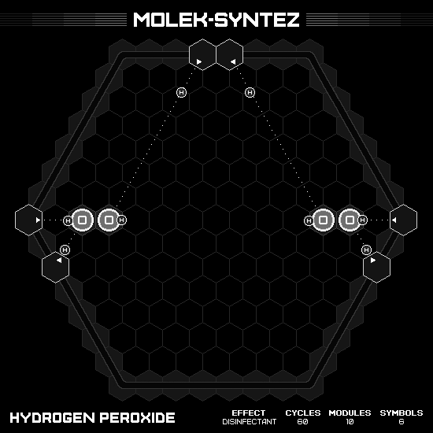
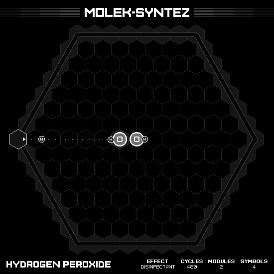
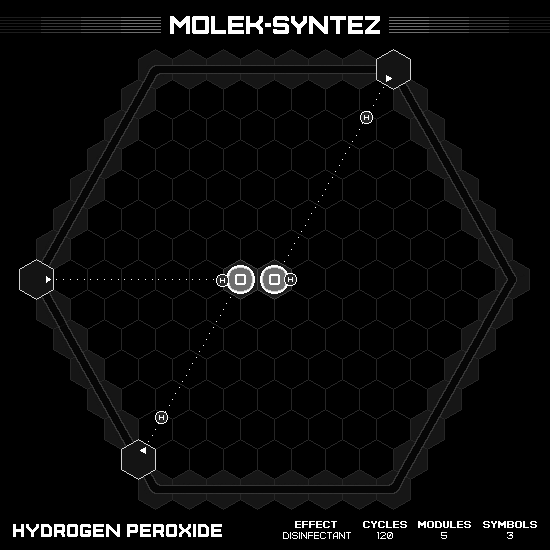

# Hydrogen Peroxide

## MIN CYCLES

### Animation

### Emitter Positions

- Emitter 1 at position -7 hexes to the right and 0 hexes up-right with rotation of 0.
- Emitter 2 at position -3 hexes to the right and 7 hexes up-right with rotation of -1.
- Emitter 3 at position -4 hexes to the right and 7 hexes up-right with rotation of -2.
- Emitter 4 at position 7 hexes to the right and 0 hexes up-right with rotation of -3.
- Emitter 5 at position 7 hexes to the right and -2 hexes up-right with rotation of -4.
- Emitter 6 at position -5 hexes to the right and -2 hexes up-right with rotation of -5.

### Emitter Commands

|  # | 1                                                     | 2                                                     | 3                                                     | 4                                                     | 5                                                     | 6                                                     |
|---:|:-----------------------------------------------------:|:-----------------------------------------------------:|:-----------------------------------------------------:|:-----------------------------------------------------:|:-----------------------------------------------------:|:-----------------------------------------------------:|
| 01 |  |  |  |  |  |  |

## MIN MODULES

### Animation

### Emitter Positions

- Emitter 1 at position -7 hexes to the right and 0 hexes up-right with rotation of 0.

### Emitter Commands

|  # | 1                                                     |
|---:|:-----------------------------------------------------:|
| 01 |  |
| 02 |      |
| 03 |  |
| 04 |  |

## MIN SYMBOLS

### Animation

### Emitter Positions

- Emitter 1 at position -7 hexes to the right and 0 hexes up-right with rotation of 0.
- Emitter 3 at position 0 hexes to the right and 7 hexes up-right with rotation of -2.
- Emitter 6 at position -1 hexes to the right and -6 hexes up-right with rotation of -5.

### Emitter Commands

|  # | 1                                                     | 3                                                     | 6                                                     |
|---:|:-----------------------------------------------------:|:-----------------------------------------------------:|:-----------------------------------------------------:|
| 01 |  |  |  |

