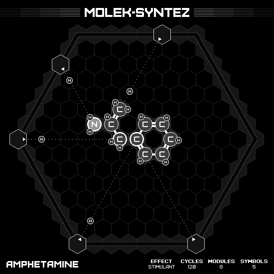
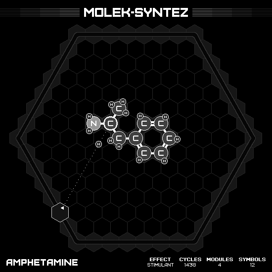

# Amphetamine

## MIN CYCLES

### Animation

### Emitter Positions

- Emitter 1 at position -7 hexes to the right and 0 hexes up-right with rotation of 0.
- Emitter 2 at position -7 hexes to the right and 5 hexes up-right with rotation of -1.
- Emitter 3 at position -2 hexes to the right and 7 hexes up-right with rotation of -2.
- Emitter 5 at position 7 hexes to the right and -7 hexes up-right with rotation of -4.
- Emitter 6 at position 0 hexes to the right and -7 hexes up-right with rotation of -5.

### Emitter Commands

|  # |                                                                 1 |                                                                 2 |                                                                 3 |                                                                 5 |                                                                 6 |
|---:|:------------------------------------------------------------------|:------------------------------------------------------------------|:------------------------------------------------------------------|:------------------------------------------------------------------|:------------------------------------------------------------------|
| 01 |              |              |                    |              |              |

## MIN MODULES

### Animation

### Emitter Positions

- Emitter 6 at position 0 hexes to the right and -7 hexes up-right with rotation of -5.

### Emitter Commands

|  # |                                                                 6 |
|---:|:------------------------------------------------------------------|
| 01 |              |
| 02 |    |
| 03 |              |
| 04 |    |
| 05 |    |
| 06 |                |
| 07 |  |
| 08 |                |
| 09 |                    |
| 10 |              |
| 11 |  |
| 12 |  |

## MIN SYMBOLS

### Animation

### Emitter Positions

- Emitter 1 at position -7 hexes to the right and 0 hexes up-right with rotation of 0.
- Emitter 2 at position -7 hexes to the right and 5 hexes up-right with rotation of -1.
- Emitter 3 at position -2 hexes to the right and 7 hexes up-right with rotation of -2.
- Emitter 5 at position 7 hexes to the right and -7 hexes up-right with rotation of -4.
- Emitter 6 at position 0 hexes to the right and -7 hexes up-right with rotation of -5.

### Emitter Commands

|  # |                                                                 1 |                                                                 2 |                                                                 3 |                                                                 5 |                                                                 6 |
|---:|:------------------------------------------------------------------|:------------------------------------------------------------------|:------------------------------------------------------------------|:------------------------------------------------------------------|:------------------------------------------------------------------|
| 01 |              |              |                    |              |              |

