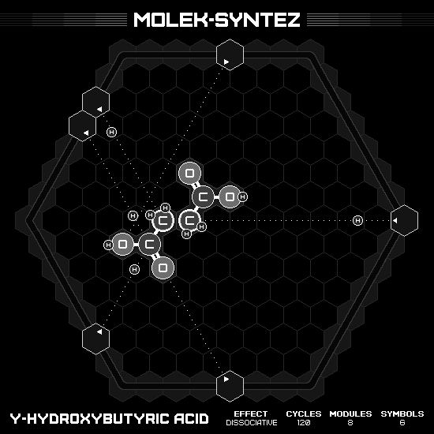
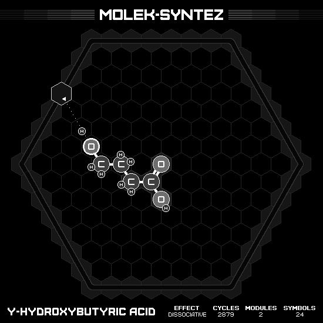
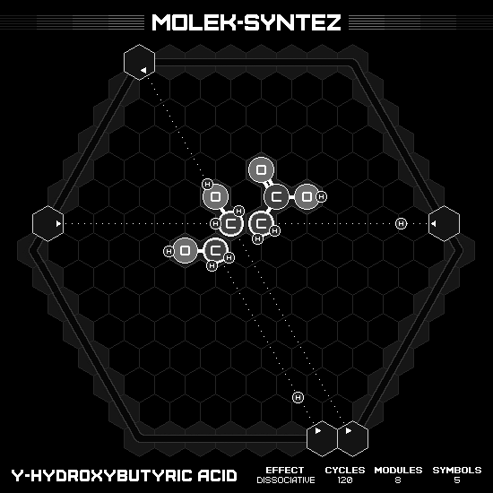

# γ-Hydroxybutyric Acid

## MIN CYCLES

### Animation

### Emitter Positions

- Emitter 1 at position -7 hexes to the right and 4 hexes up-right with rotation of -1.
- Emitter 2 at position -7 hexes to the right and 5 hexes up-right with rotation of -1.
- Emitter 3 at position -3 hexes to the right and 7 hexes up-right with rotation of -2.
- Emitter 4 at position 7 hexes to the right and 0 hexes up-right with rotation of -3.
- Emitter 5 at position 4 hexes to the right and -7 hexes up-right with rotation of -4.
- Emitter 6 at position -2 hexes to the right and -5 hexes up-right with rotation of -5.

### Emitter Commands

|  # | 1                                               | 2                                                     | 3                                                     | 4                                                     | 5                                                   | 6                                               |
|---:|:-----------------------------------------------:|:-----------------------------------------------------:|:-----------------------------------------------------:|:-----------------------------------------------------:|:---------------------------------------------------:|:-----------------------------------------------:|
| 01 |  |  |  |  |  |  |

## MIN MODULES

### Animation

### Emitter Positions

- Emitter 2 at position -7 hexes to the right and 5 hexes up-right with rotation of -1.

### Emitter Commands

|  # | 2                                                                 |
|---:|:-----------------------------------------------------------------:|
| 01 |        |
| 02 |        |
| 03 |        |
| 04 |              |
| 05 |                  |
| 06 |  |
| 07 |        |
| 08 |    |
| 09 |              |
| 10 |  |
| 11 |      |
| 12 |    |
| 13 |  |
| 14 |  |
| 15 |                    |
| 16 |                    |
| 17 |                |
| 18 |    |
| 19 |                |
| 20 |                    |
| 21 |                |
| 22 |                    |
| 23 |              |
| 24 |    |

## MIN SYMBOLS

### Animation

### Emitter Positions

- Emitter 1 at position -7 hexes to the right and 1 hexes up-right with rotation of 0.
- Emitter 2 at position 7 hexes to the right and -7 hexes up-right with rotation of -28.
- Emitter 3 at position 6 hexes to the right and 1 hexes up-right with rotation of 3.
- Emitter 4 at position -7 hexes to the right and 7 hexes up-right with rotation of -7.
- Emitter 5 at position 6 hexes to the right and -7 hexes up-right with rotation of -4.

### Emitter Commands

|  # | 1                                                     | 2                                                   | 3                                                     | 4                                                   | 5                                                     |
|---:|:-----------------------------------------------------:|:---------------------------------------------------:|:-----------------------------------------------------:|:---------------------------------------------------:|:-----------------------------------------------------:|
| 01 |  |  |  |  |  |

