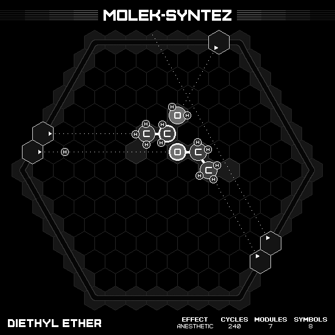

# Diethyl Ether

## SOLUTION

### Animation

### Emitter Positions

- Emitter 1 at position -7 hexes to the right and 2 hexes up-right with rotation of -6.
- Emitter 3 at position -1 hexes to the right and 7 hexes up-right with rotation of -2.
- Emitter 4 at position 7 hexes to the right and -5 hexes up-right with rotation of -4.
- Emitter 5 at position -7 hexes to the right and 1 hexes up-right with rotation of -6.
- Emitter 6 at position 7 hexes to the right and -4 hexes up-right with rotation of -4.

### Emitter Commands

|  # | 1                                               | 3                                                   | 4                                                     | 5                                                     | 6                                                   |
|---:|:-----------------------------------------------:|:---------------------------------------------------:|:-----------------------------------------------------:|:-----------------------------------------------------:|:---------------------------------------------------:|
| 01 |  |      |        |    |  |
| 02 |              |  |  |  |                  |

