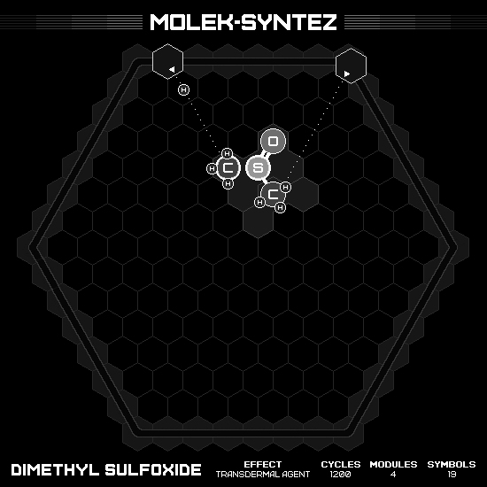

# Dimethyl Sulfoxide

## MIN MODULES

### Animation

### Emitter Positions

- Emitter 2 at position -6 hexes to the right and 7 hexes up-right with rotation of -1.
- Emitter 3 at position 0 hexes to the right and 7 hexes up-right with rotation of -2.

### Emitter Commands

|  # | 2                                                     | 3                                                                 |
|---:|:-----------------------------------------------------:|:-----------------------------------------------------------------:|
| 01 |        |                    |
| 02 |    |                |
| 03 |        |                    |
| 04 |        |                    |
| 05 |    |    |
| 06 |        |                    |
| 07 |      |                    |
| 08 |      |                |
| 09 |  |  |
| 10 |                    |              |

