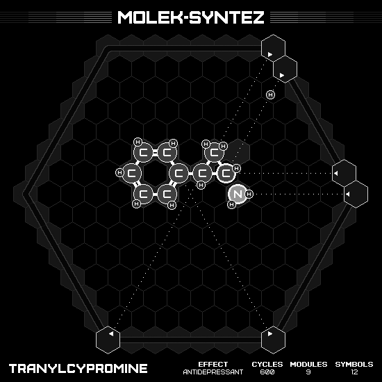

# Tranylcypromine

## SOLUTION

### Animation

### Emitter Positions

- Emitter 1 at position 6 hexes to the right and 1 hexes up-right with rotation of -3.
- Emitter 2 at position 0 hexes to the right and 7 hexes up-right with rotation of -2.
- Emitter 3 at position 1 hexes to the right and 6 hexes up-right with rotation of -2.
- Emitter 4 at position 7 hexes to the right and 0 hexes up-right with rotation of -3.
- Emitter 5 at position 7 hexes to the right and -7 hexes up-right with rotation of -4.
- Emitter 6 at position 0 hexes to the right and -7 hexes up-right with rotation of -5.

### Emitter Commands

|  # | 1                                                     | 2                                                     | 3                                                     | 4                                                     | 5                                                     | 6                                                   |
|---:|:-----------------------------------------------------:|:-----------------------------------------------------:|:-----------------------------------------------------:|:-----------------------------------------------------:|:-----------------------------------------------------:|:---------------------------------------------------:|
| 01 |                    |                    |        |  |  |  |
| 02 |                    |                    |        |                    |                    |  |
| 03 |                    |                    |      |                    |                    |                  |
| 04 |  |  |  |                    |                    |                  |
| 05 |                    |  |  |                    |                    |                  |

