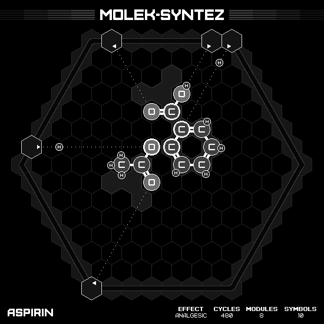

# Aspirin

## SOLUTION

### Animation

### Emitter Positions

- Emitter 1 at position -7 hexes to the right and 1 hexes up-right with rotation of 0.
- Emitter 2 at position -6 hexes to the right and 7 hexes up-right with rotation of -1.
- Emitter 3 at position -1 hexes to the right and 7 hexes up-right with rotation of -2.
- Emitter 4 at position 0 hexes to the right and 7 hexes up-right with rotation of -2.
- Emitter 6 at position 0 hexes to the right and -7 hexes up-right with rotation of -5.

### Emitter Commands

|  # | 1                                                     | 2                                                 | 3                                                   | 4                                                     | 6                                                     |
|---:|:-----------------------------------------------------:|:-------------------------------------------------:|:---------------------------------------------------:|:-----------------------------------------------------:|:-----------------------------------------------------:|
| 01 |  |                |      |                    |                    |
| 02 |                    |                |  |                    |      |
| 03 |        |  |                  |                    |  |
| 04 |  |                |                  |  |  |

