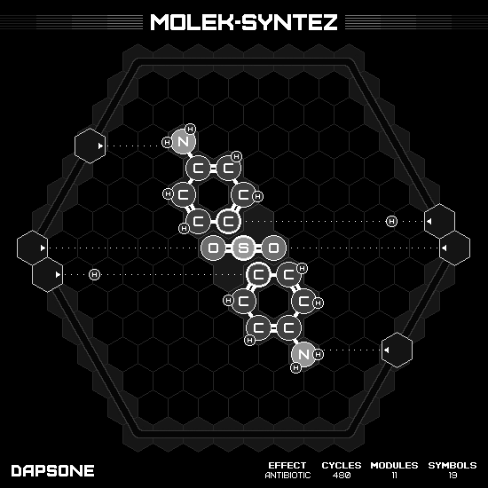

# Dapsone

## SOLUTION

### Animation

### Emitter Positions

- Emitter 1 at position -6 hexes to the right and -1 hexes up-right with rotation of 0.
- Emitter 2 at position -7 hexes to the right and 0 hexes up-right with rotation of 0.
- Emitter 3 at position 6 hexes to the right and 1 hexes up-right with rotation of -3.
- Emitter 4 at position 7 hexes to the right and 0 hexes up-right with rotation of -3.
- Emitter 5 at position 7 hexes to the right and -4 hexes up-right with rotation of -9.
- Emitter 6 at position -7 hexes to the right and 4 hexes up-right with rotation of -6.

### Emitter Commands

|  # | 1                                                     | 2                                                     | 3                                                     | 4                                                     | 5                                                                 | 6                                                                 |
|---:|:-----------------------------------------------------:|:-----------------------------------------------------:|:-----------------------------------------------------:|:-----------------------------------------------------:|:-----------------------------------------------------------------:|:-----------------------------------------------------------------:|
| 01 |        |  |        |  |              |              |
| 02 |        |                    |        |                    |  |  |
| 03 |    |                    |    |                    |              |              |
| 04 |  |  |  |                    |    |    |

