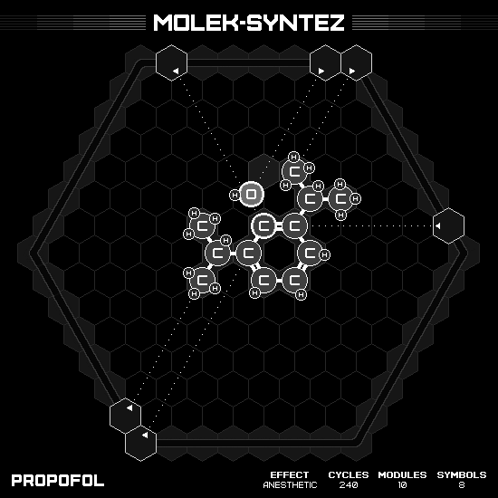
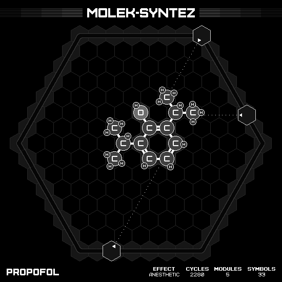
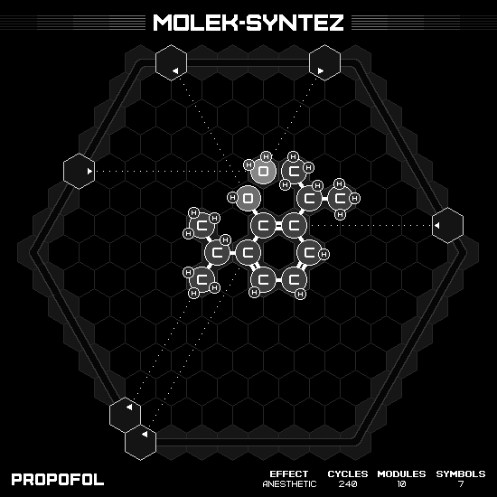

# Propofol

## MIN CYCLES

### Animation

### Emitter Positions

- Emitter 1 at position 0 hexes to the right and -7 hexes up-right with rotation of 1.
- Emitter 2 at position -6 hexes to the right and 7 hexes up-right with rotation of -1.
- Emitter 3 at position 0 hexes to the right and 7 hexes up-right with rotation of -2.
- Emitter 4 at position 6 hexes to the right and 1 hexes up-right with rotation of -3.
- Emitter 5 at position -1 hexes to the right and 7 hexes up-right with rotation of -8.
- Emitter 6 at position -1 hexes to the right and -6 hexes up-right with rotation of -5.

### Emitter Commands

|  # | 1                                                     | 2                                                     | 3                                               | 4                                                     | 5                                                     | 6                                                     |
|---:|:-----------------------------------------------------:|:-----------------------------------------------------:|:-----------------------------------------------:|:-----------------------------------------------------:|:-----------------------------------------------------:|:-----------------------------------------------------:|
| 01 |  |  |  |  |  |        |
| 02 |                    |                    |              |                    |      |  |

## MIN MODULES

### Animation

### Emitter Positions

- Emitter 1 at position 2 hexes to the right and -7 hexes up-right with rotation of 1.
- Emitter 4 at position 5 hexes to the right and 2 hexes up-right with rotation of -3.
- Emitter 5 at position 0 hexes to the right and 7 hexes up-right with rotation of -8.
- Emitter 6 at position -7 hexes to the right and 0 hexes up-right with rotation of -6.

### Emitter Commands

|  # | 1                                                                 | 4                                                                 | 5                                                                 | 6                                                                 |
|---:|:-----------------------------------------------------------------:|:-----------------------------------------------------------------:|:-----------------------------------------------------------------:|:-----------------------------------------------------------------:|
| 01 |                    |              |                    |                                |
| 02 |                    |                                |                    |                                |
| 03 |    |                                |    |                                |
| 04 |                    |                                |                    |                                |
| 05 |                    |                                |                    |                                |
| 06 |    |                                |      |                                |
| 07 |                                |                                |      |                                |
| 08 |                                |                                |      |        |
| 09 |                                |      |  |        |
| 10 |                                |    |                                |                  |
| 11 |    |                                |                                |    |
| 12 |        |                                |                                |              |
| 13 |  |                                |                                |  |
| 14 |              |              |                                |                                |
| 15 |  |  |                                |                                |
| 16 |  |              |                                |                                |

## MIN SYMBOLS

### Animation

### Emitter Positions

- Emitter 1 at position 0 hexes to the right and -7 hexes up-right with rotation of 1.
- Emitter 2 at position -6 hexes to the right and 7 hexes up-right with rotation of -1.
- Emitter 3 at position -7 hexes to the right and 3 hexes up-right with rotation of -6.
- Emitter 4 at position 6 hexes to the right and 1 hexes up-right with rotation of -3.
- Emitter 5 at position -1 hexes to the right and 7 hexes up-right with rotation of -8.
- Emitter 6 at position -1 hexes to the right and -6 hexes up-right with rotation of -5.

### Emitter Commands

|  # | 1                                                     | 2                                                     | 3                                                   | 4                                                     | 5                                                 | 6                                                     |
|---:|:-----------------------------------------------------:|:-----------------------------------------------------:|:---------------------------------------------------:|:-----------------------------------------------------:|:-------------------------------------------------:|:-----------------------------------------------------:|
| 01 |  |  |  |  |  |        |
| 02 |                    |                    |                  |                    |                |  |

