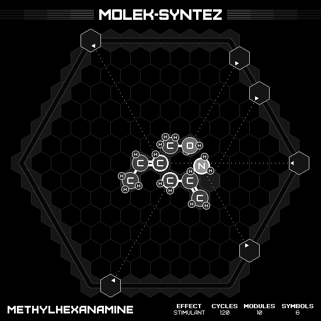

# Methylhexanamine

## MIN CYCLES, MIN SYMBOLS

### Animation

### Emitter Positions

- Emitter 1 at position 7 hexes to the right and 0 hexes up-right with rotation of 3.
- Emitter 2 at position -7 hexes to the right and 7 hexes up-right with rotation of -1.
- Emitter 3 at position 1 hexes to the right and 6 hexes up-right with rotation of -2.
- Emitter 4 at position 7 hexes to the right and -5 hexes up-right with rotation of -4.
- Emitter 5 at position 3 hexes to the right and 4 hexes up-right with rotation of -2.
- Emitter 6 at position 1 hexes to the right and -7 hexes up-right with rotation of -5.

### Emitter Commands

|  # | 1                                                   | 2                                                     | 3                                                   | 4                                                 | 5                                                   | 6                                                   |
|---:|:---------------------------------------------------:|:-----------------------------------------------------:|:---------------------------------------------------:|:-------------------------------------------------:|:---------------------------------------------------:|:---------------------------------------------------:|
| 01 |  |  |  |  |  |  |

