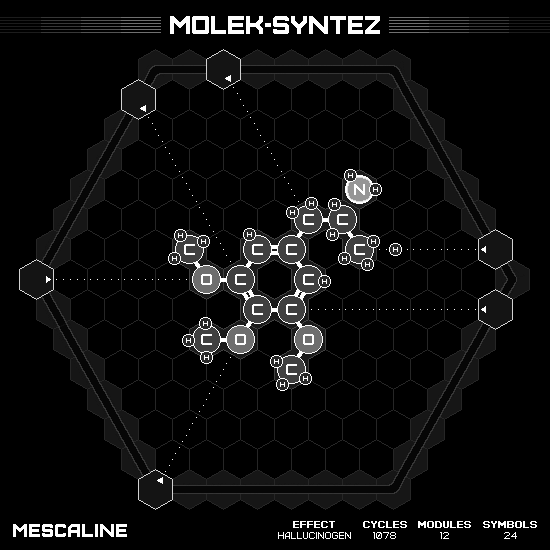

# Mescaline

## SOLUTION

### Animation

### Emitter Positions

- Emitter 1 at position -7 hexes to the right and 0 hexes up-right with rotation of 0.
- Emitter 2 at position -7 hexes to the right and 6 hexes up-right with rotation of -1.
- Emitter 3 at position 4 hexes to the right and 3 hexes up-right with rotation of -9.
- Emitter 4 at position 7 hexes to the right and -1 hexes up-right with rotation of -3.
- Emitter 5 at position -5 hexes to the right and 7 hexes up-right with rotation of -7.
- Emitter 6 at position 0 hexes to the right and -7 hexes up-right with rotation of -5.

### Emitter Commands

|  # | 1                                                                 | 2                                                     | 3                                                                 | 4                                                                 | 5                                                                 | 6                                                     |
|---:|:-----------------------------------------------------------------:|:-----------------------------------------------------:|:-----------------------------------------------------------------:|:-----------------------------------------------------------------:|:-----------------------------------------------------------------:|:-----------------------------------------------------:|
| 01 |              |  |              |              |              |  |
| 02 |  |                    |    |    |  |                    |
| 03 |              |                    |                    |              |              |                    |
| 04 |    |                    |    |  |    |                    |
| 05 |                                |                    |                    |                                |                                |                    |
| 06 |                                |                    |                    |                                |                                |                    |
| 07 |                                |                    |                |              |                                |                    |
| 08 |                                |                    |  |                                |                                |                    |
| 09 |                                |                    |  |                                |                                |                    |

