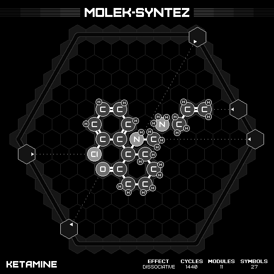

# Ketamine

## SOLUTION

### Animation

### Emitter Positions

- Emitter 1 at position -6 hexes to the right and -1 hexes up-right with rotation of 0.
- Emitter 2 at position 5 hexes to the right and 2 hexes up-right with rotation of -3.
- Emitter 3 at position 0 hexes to the right and 7 hexes up-right with rotation of -2.
- Emitter 4 at position 7 hexes to the right and 0 hexes up-right with rotation of -3.
- Emitter 6 at position -1 hexes to the right and -6 hexes up-right with rotation of -5.

### Emitter Commands

|  # | 1                                                                 | 2                                                   | 3                                                                 | 4                                                     | 6                                                                 |
|---:|:-----------------------------------------------------------------:|:---------------------------------------------------:|:-----------------------------------------------------------------:|:-----------------------------------------------------:|:-----------------------------------------------------------------:|
| 01 |                                |      |                                |  |              |
| 02 |                                |      |                                |                    |              |
| 03 |                                |  |                                |                    |  |
| 04 |                                |      |                                |                    |              |
| 05 |                                |      |              |                    |              |
| 06 |              |      |              |                    |    |
| 07 |                                |                  |    |                    |                                |
| 08 |                                |                  |              |                    |                                |
| 09 |    |                  |              |                    |                                |
| 10 |              |  |                  |                    |                                |
| 11 |  |                  |                                |      |                                |
| 12 |              |                  |  |                    |                                |

