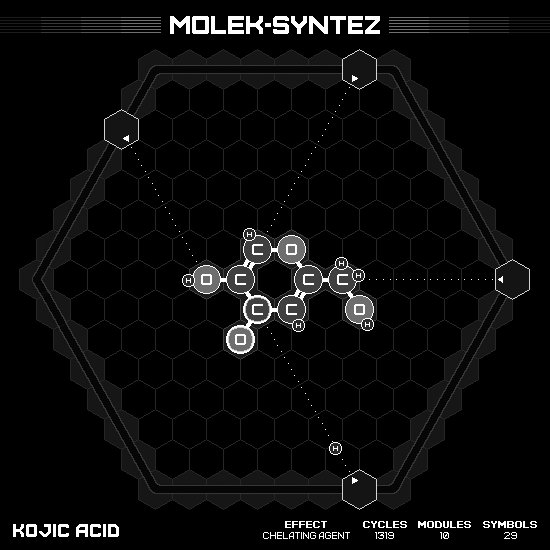

# Kojic Acid

## SOLUTION

### Animation

### Emitter Positions

- Emitter 2 at position -7 hexes to the right and 5 hexes up-right with rotation of -1.
- Emitter 3 at position -1 hexes to the right and 7 hexes up-right with rotation of -2.
- Emitter 4 at position 7 hexes to the right and 0 hexes up-right with rotation of -3.
- Emitter 5 at position 7 hexes to the right and -7 hexes up-right with rotation of -4.

### Emitter Commands

|  # | 2                                                                 | 3                                                                 | 4                                                                 | 5                                                                 |
|---:|:-----------------------------------------------------------------:|:-----------------------------------------------------------------:|:-----------------------------------------------------------------:|:-----------------------------------------------------------------:|
| 01 |              |              |                    |              |
| 02 |    |    |    |              |
| 03 |              |              |              |    |
| 04 |  |              |  |              |
| 05 |                                |    |              |    |
| 06 |                                |              |                                |              |
| 07 |                                |  |                                |              |
| 08 |                                |  |                                |  |
| 09 |                                |                                |                                |              |
| 10 |                                |              |                                |              |
| 11 |                                |                                |                                |  |

