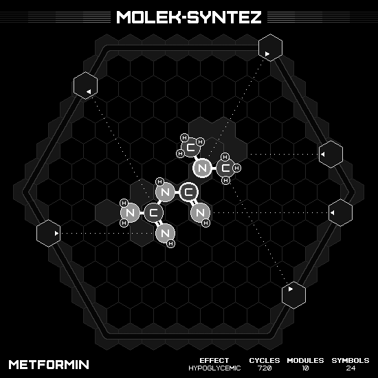

# Metformin

## SOLUTION

### Animation

### Emitter Positions

- Emitter 1 at position -5 hexes to the right and -2 hexes up-right with rotation of 0.
- Emitter 2 at position -7 hexes to the right and 5 hexes up-right with rotation of -1.
- Emitter 3 at position 0 hexes to the right and 7 hexes up-right with rotation of -2.
- Emitter 4 at position 5 hexes to the right and 2 hexes up-right with rotation of -3.
- Emitter 5 at position 7 hexes to the right and -1 hexes up-right with rotation of -9.
- Emitter 6 at position 7 hexes to the right and -5 hexes up-right with rotation of -10.

### Emitter Commands

|  # | 1                                                     | 2                                                                 | 3                                                   | 4                                                                 | 5                                                     | 6                                                     |
|---:|:-----------------------------------------------------:|:-----------------------------------------------------------------:|:---------------------------------------------------:|:-----------------------------------------------------------------:|:-----------------------------------------------------:|:-----------------------------------------------------:|
| 01 |  |                    |      |                    |  |  |
| 02 |                    |                    |      |    |                    |  |
| 03 |                    |                |      |                    |                    |  |
| 04 |                    |    |  |                    |                    |                    |
| 05 |      |              |                  |                |                    |                    |
| 06 |  |  |    |  |                    |                    |

