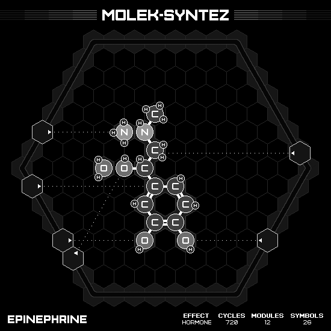

# Epinephrine

## SOLUTION

### Animation

### Emitter Positions

- Emitter 1 at position -7 hexes to the right and 2 hexes up-right with rotation of 0.
- Emitter 2 at position -6 hexes to the right and -1 hexes up-right with rotation of -6.
- Emitter 3 at position 6 hexes to the right and 1 hexes up-right with rotation of -3.
- Emitter 4 at position 7 hexes to the right and -4 hexes up-right with rotation of -3.
- Emitter 5 at position -3 hexes to the right and -4 hexes up-right with rotation of -12.
- Emitter 6 at position -2 hexes to the right and -5 hexes up-right with rotation of -5.

### Emitter Commands

|  # | 1                                                     | 2                                                                 | 3                                                                 | 4                                                                 | 5                                                                 | 6                                                     |
|---:|:-----------------------------------------------------:|:-----------------------------------------------------------------:|:-----------------------------------------------------------------:|:-----------------------------------------------------------------:|:-----------------------------------------------------------------:|:-----------------------------------------------------:|
| 01 |  |              |                    |              |              |        |
| 02 |  |    |    |  |    |      |
| 03 |      |              |                    |              |              |  |
| 04 |                    |                  |              |    |  |                    |
| 05 |                    |  |              |                                |                                |                    |
| 06 |                    |              |  |                                |                                |                    |

