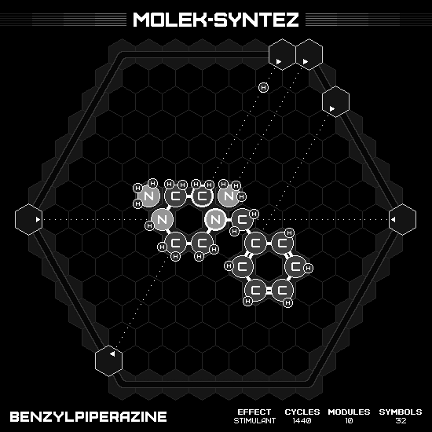

# Benzylpiperazine

## SOLUTION

### Animation

### Emitter Positions

- Emitter 1 at position -7 hexes to the right and 0 hexes up-right with rotation of 0.
- Emitter 2 at position 0 hexes to the right and 7 hexes up-right with rotation of -2.
- Emitter 3 at position -1 hexes to the right and 7 hexes up-right with rotation of -2.
- Emitter 4 at position 7 hexes to the right and 0 hexes up-right with rotation of -3.
- Emitter 5 at position 2 hexes to the right and 5 hexes up-right with rotation of -8.
- Emitter 6 at position -1 hexes to the right and -6 hexes up-right with rotation of -5.

### Emitter Commands

|  # | 1                                                     | 2                                                 | 3                                                                 | 4                                                     | 5                                                     | 6                                                                 |
|---:|:-----------------------------------------------------:|:-------------------------------------------------:|:-----------------------------------------------------------------:|:-----------------------------------------------------:|:-----------------------------------------------------:|:-----------------------------------------------------------------:|
| 01 |        |                |                    |        |  |                    |
| 02 |        |                |  |        |                    |  |
| 03 |    |                |                    |      |                    |                    |
| 04 |                    |  |  |  |                    |                                |
| 05 |  |                |                                |  |                    |              |
| 06 |  |                |                                |                    |                    |    |
| 07 |  |                |                                |                    |                    |              |
| 08 |                    |                |                  |                    |                    |                                |
| 09 |  |                |    |                    |                    |                                |
| 10 |  |                |              |                    |                    |                                |
| 11 |      |                |    |                    |                    |                                |
| 12 |                    |                |              |  |                    |                                |

