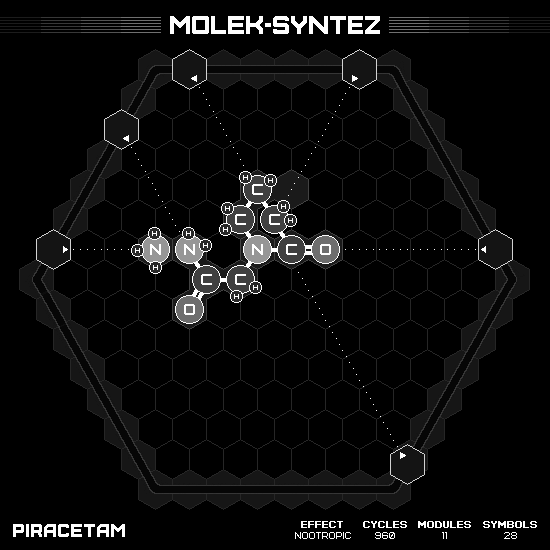

# Piracetam

## SOLUTION

### Animation

### Emitter Positions

- Emitter 1 at position -7 hexes to the right and 1 hexes up-right with rotation of 0.
- Emitter 2 at position -7 hexes to the right and 5 hexes up-right with rotation of -1.
- Emitter 3 at position -6 hexes to the right and 7 hexes up-right with rotation of -7.
- Emitter 4 at position 6 hexes to the right and 1 hexes up-right with rotation of -3.
- Emitter 5 at position 7 hexes to the right and -6 hexes up-right with rotation of -4.
- Emitter 6 at position -1 hexes to the right and 7 hexes up-right with rotation of -14.

### Emitter Commands

|  # | 1                                                     | 2                                                   | 3                                                                 | 4                                                                 | 5                                                                 | 6                                                     |
|---:|:-----------------------------------------------------:|:---------------------------------------------------:|:-----------------------------------------------------------------:|:-----------------------------------------------------------------:|:-----------------------------------------------------------------:|:-----------------------------------------------------:|
| 01 |  |      |                    |              |              |        |
| 02 |                    |  |                    |    |              |        |
| 03 |      |                  |  |              |              |      |
| 04 |                    |                  |              |  |    |                    |
| 05 |                    |                  |    |                                |              |  |
| 06 |                    |                  |              |                                |              |                    |
| 07 |                    |                  |                                |                                |              |  |
| 08 |                    |                  |                                |                                |  |  |

