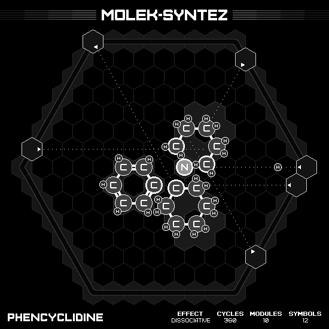

# Phencyclidine

## MIN CYCLES, MIN SYMBOLS

### Animation

### Emitter Positions

- Emitter 1 at position 7 hexes to the right and -1 hexes up-right with rotation of -3.
- Emitter 2 at position 1 hexes to the right and 6 hexes up-right with rotation of -2.
- Emitter 3 at position 7 hexes to the right and -5 hexes up-right with rotation of -4.
- Emitter 4 at position 7 hexes to the right and 0 hexes up-right with rotation of -3.
- Emitter 5 at position -7 hexes to the right and 1 hexes up-right with rotation of -6.
- Emitter 6 at position -7 hexes to the right and 7 hexes up-right with rotation of -13.

### Emitter Commands

|  # | 1                                                     | 2                                                 | 3                                                   | 4                                                     | 5                                               | 6                                                     |
|---:|:-----------------------------------------------------:|:-------------------------------------------------:|:---------------------------------------------------:|:-----------------------------------------------------:|:-----------------------------------------------:|:-----------------------------------------------------:|
| 01 |  |                |                  |  |  |  |
| 02 |                    |                |  |  |  |  |
| 03 |  |  |                  |  |              |      |

