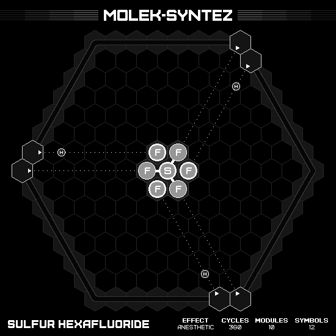
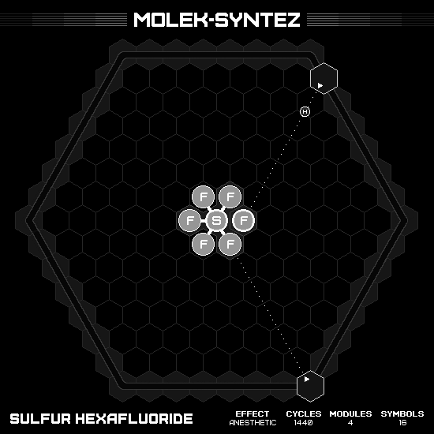

# Sulfur Hexafluoride

## MIN CYCLES, MIN SYMBOLS

### Animation

### Emitter Positions

- Emitter 1 at position -7 hexes to the right and 0 hexes up-right with rotation of 0.
- Emitter 2 at position -7 hexes to the right and 1 hexes up-right with rotation of -6.
- Emitter 3 at position 0 hexes to the right and 7 hexes up-right with rotation of -2.
- Emitter 4 at position 1 hexes to the right and 6 hexes up-right with rotation of -8.
- Emitter 5 at position 7 hexes to the right and -7 hexes up-right with rotation of -4.
- Emitter 6 at position 6 hexes to the right and -7 hexes up-right with rotation of -10.

### Emitter Commands

|  # | 1                                                             | 2                                                     | 3                                               | 4                                                     | 5                                                     | 6                                                     |
|---:|:-------------------------------------------------------------:|:-----------------------------------------------------:|:-----------------------------------------------:|:-----------------------------------------------------:|:-----------------------------------------------------:|:-----------------------------------------------------:|
| 01 |            |    |              |    |    |    |
| 02 |  |    |  |                    |                    |                    |
| 03 |                            |  |              |  |  |  |

## MIN MODULES

### Animation

### Emitter Positions

- Emitter 4 at position 1 hexes to the right and 6 hexes up-right with rotation of -2.
- Emitter 5 at position 7 hexes to the right and -7 hexes up-right with rotation of -4.

### Emitter Commands

|  # | 4                                                     | 5                                                             |
|---:|:-----------------------------------------------------:|:-------------------------------------------------------------:|
| 01 |    |            |
| 02 |                    |  |
| 03 |  |                            |
| 04 |                    |  |
| 05 |    |            |
| 06 |                    |  |
| 07 |  |                            |
| 08 |                    |  |
| 09 |    |                |
| 10 |                    |            |
| 11 |                    |  |
| 12 |  |          |

